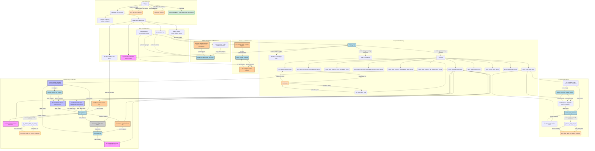

```mermaid
graph TD
    subgraph App Initialization
        A[app.py] --> B(Dash App `app` instance)
        B --> C(Register Callbacks `register_callbacks`)
        B --> D(Initial Layout `app.layout`)
        
        A -- Calls Hilltop API at startup --> HA1(fetch_site_list_collection)
        A -- Calls Hilltop API at startup --> HA2(Hilltop.get_site_list)
        HA1 & HA2 -- Returns site data --> A
        A -- Populates --> MFD(MEASUREMENTS_FOR_MAPS_AND_DATASETS)
    end

    subgraph Main Layout Structure
        D --> D1(dcc.Location `url`)
        D --> D2(dcc.Store `hilltop-data-store`)
        D --> D3(Header Layout `serve_header_layout`)
        D --> D4(Sidebar Layout `serve_sidebar_layout`)
        D --> D5(Dynamic Page Content `page-content`)
    end

    subgraph Header & Navbar Collapse
        D3 --> H1(dbc.NavbarToggler `navbar-toggler`)
        D3 --> H2(dbc.Collapse `navbar-collapse`)
        H1 -- n_clicks --> CB1(toggle_navbar_collapse)
        H2 -- is_open (State) --> CB1
        CB1 -- is_open (Output) --> H2
    end

    subgraph Sidebar Navigation & URL Update
        D4 --> S1(dbc.Accordion `main-sidebar-accordion`)
        S1 -- active_item (Output) --> CB2(update_url_and_active_accordion)
        S2(Buttons `sidebar-sub-topic-button`, `sidebar-main-topic-button`)
        S2 -- n_clicks (Input) --> CB2
        D1 -- pathname (State) --> CB2
        CB2 -- pathname (Output) --> D1
    end

    subgraph Page Content Display
        D1 -- pathname (Input) --> CB3(display_page)
        CB3 -- children (Output) --> D5
        CB3 -- children (Output, hidden) --> D6(html.Div `current-page-path`)
        
        CB3 -- Calls data_processing functions --> DP[data_processing.py]
        DP --> DP1(get_rainfall_summary_data)
        DP --> DP2(get_flow_status_data)
        
        DP1 & DP2 -- Calls Hilltop API --> HA3(fetch_data)
        HA3 -- Data from Hilltop --> DP1
        HA3 -- Data from Hilltop --> DP2

        CB3 -- Calls layout serving functions --> L[layout.py]
        L --> L1(serve_quick_reference_rainfall_summary_layout)
        L --> L2(serve_quick_reference_river_flow_status_layout)
        L --> L3(serve_quick_reference_waiwhakaiho_egmont_village_layout)
        L --> L4(serve_quick_reference_waiwhakaiho_report_layout)
        L --> L5(serve_quick_reference_air_quality_report_layout)
        L --> L6(serve_map_page_layout)
        L --> L7(serve_datasets_page_layout)
        L --> L8(serve_charts_page_layout)
        L --> L9(serve_reports_page_layout)
        L --> L10(serve_default_page_layout)
    end

    subgraph Maps Page Callbacks
        L6 --> M1(dcc.Dropdown `map-measurement-dropdown`)
        L6 --> M2(dcc.Dropdown `map-time-period-dropdown`)
        L6 --> M3(dl.LayerGroup `marker-layer`)
        M1 -- value (Input) --> CB4(update_map_time_period_options)
        CB4 -- options (Output) --> M2
        CB4 -- value (Output) --> M2
        M1 -- value (Input) --> CB5(update_map_markers)
        M2 -- value (Input) --> CB5
        CB5 -- children (Output) --> M3
        CB5 -- Calls data_processing functions --> DP3(process_map_data_2)
        DP3 -- Calls Hilltop API --> HA4(fetch_data_table_for_custom_collection)
        HA4 -- Data from Hilltop --> DP3
    end

    subgraph Datasets Page Callbacks
        L7 --> DPF1(dcc.Dropdown `dataset-measurement-dropdown`)
        L7 --> DPF2(dcc.Dropdown `dataset-site-dropdown`)
        L7 --> DPF3(dcc.DatePickerRange `dataset-date-range-picker`)
        L7 --> DPF4(dbc.Button `load-dataset-btn`)
        L7 --> DPF5(html.Div `dataset-output-container`)
        L7 --> DPF6(dbc.Button `download-csv-btn`)
        L7 --> DPF7(dcc.Download `download-dataframe-csv`)
        D2 -- data (Input/Output) --> DPF8(dcc.Store `hilltop-data-store`)
        
        DPF1 -- value (Input) --> CB6(update_dataset_site_options)
        CB6 -- options (Output) --> DPF2
        CB6 -- value (Output) --> DPF2

        DPF4 -- n_clicks (Input) --> CB7(load_dataset)
        DPF1 -- value (State) --> CB7
        DPF3 -- start_date (State) --> CB7
        DPF3 -- end_date (State) --> CB7
        DPF2 -- value (State) --> CB7
        CB7 -- children (Output) --> DPF5
        CB7 -- disabled (Output) --> DPF6
        CB7 -- data (Output) --> DPF8
        CB7 -- Calls data_processing functions --> DP4(get_dataset_data_for_display)
        DP4 -- Calls Hilltop API --> HA5(fetch_data_table_for_custom_collection)
        HA5 -- Data from Hilltop --> DP4

        DPF6 -- n_clicks (Input) --> CB8(download_csv)
        DPF8 -- data (State) --> CB8
        DPF1 -- value (State) --> CB8
        CB8 -- data (Output) --> DPF7
    end

    style D5 fill:#f9f,stroke:#333,stroke-width:2px
    style S2 fill:#fc9,stroke:#333,stroke-width:2px
    style H1 fill:#fc9,stroke:#333,stroke-width:2px
    style H2 fill:#fc9,stroke:#333,stroke-width:2px
    style DPF1 fill:#bbf,stroke:#333,stroke-width:2px
    style DPF2 fill:#bbf,stroke:#333,stroke:#333,stroke-width:2px
    style DPF3 fill:#bbf,stroke:#333,stroke-width:2px
    style DPF4 fill:#fc9,stroke:#333,stroke-width:2px
    style DPF5 fill:#f9f,stroke:#333,stroke-width:2px
    style DPF6 fill:#fc9,stroke:#333,stroke-width:2px
    style DPF7 fill:#f9f,stroke:#333,stroke-width:2px
    style DPF8 fill:#ccc,stroke:#333,stroke-width:2px

    classDef callback_function fill:#ADD8E6,stroke:#333,stroke-width:2px
    class CB1,CB2,CB3,CB4,CB5,CB6,CB7,CB8 callback_function

    classDef hilltop_api_function fill:#FFDDC1,stroke:#E68A00,stroke-width:2px
    class HA1,HA2,HA3,HA4,HA5 hilltop_api_function

    classDef data_storage fill:#D1E7DD,stroke:#28A745,stroke-width:2px
    class MFD data_storage
```
