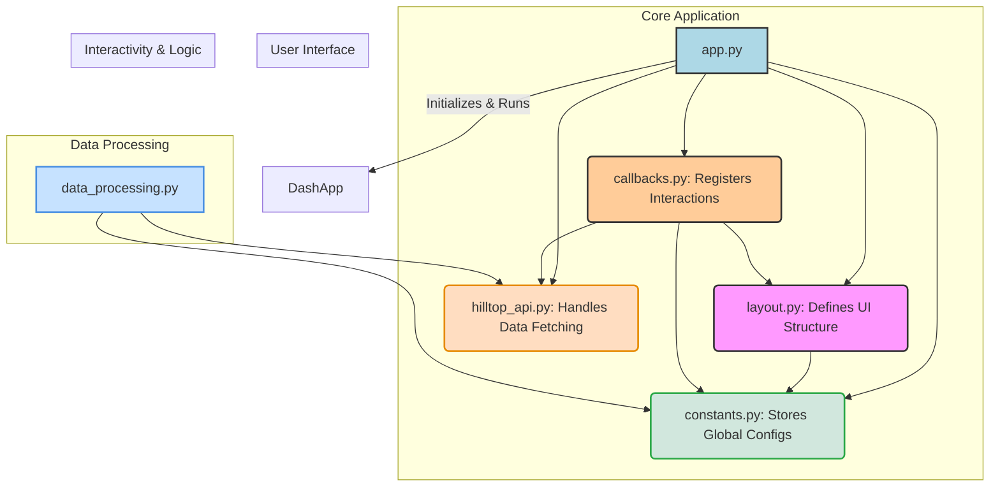

```mermaid
graph TD
    subgraph Core Application
        A[app.py] --> B(layout.py: Defines UI Structure)
        A --> C(callbacks.py: Registers Interactions)
        A --> D(hilltop_api.py: Handles Data Fetching)
        A --> E(constants.py: Stores Global Configs)
    end

    subgraph User Interface
        B --> E
    end

    subgraph Interactivity & Logic
        C --> B
        C --> D
        C --> E
    end

    subgraph Data Processing
        F[data_processing.py] --> D
        F --> E
    end

    direction LR

    A -- Initializes & Runs --> DashApp

    classDef main_file fill:#ADD8E6,stroke:#333,stroke-width:2px
    class A main_file
    classDef ui_file fill:#f9f,stroke:#333,stroke-width:2px
    class B ui_file
    classDef callbacks_file fill:#fc9,stroke:#333,stroke-width:2px
    class C callbacks_file
    classDef api_file fill:#FFDDC1,stroke:#E68A00,stroke-width:2px
    class D api_file
    classDef constants_file fill:#D1E7DD,stroke:#28A745,stroke-width:2px
    class E constants_file
    classDef data_processing_file fill:#c6e2ff,stroke:#4a90e2,stroke-width:2px
    class F data_processing_file
```