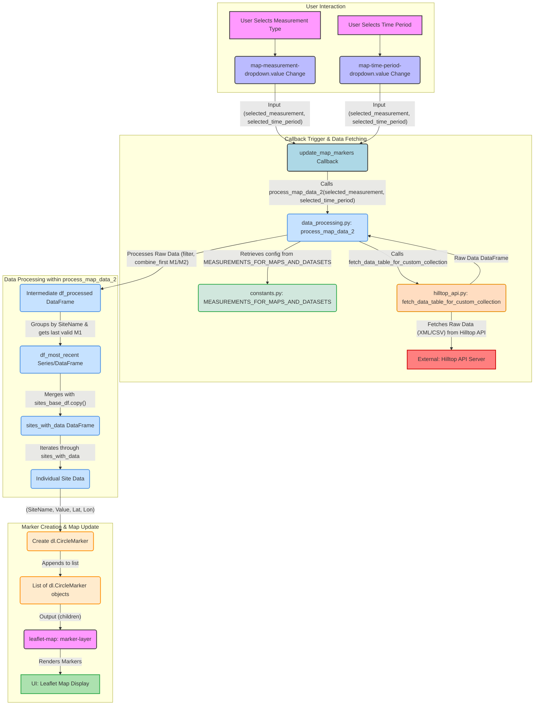

```mermaid
graph TD
    subgraph User Interaction
        A[User Selects Measurement Type] --> B(map-measurement-dropdown.value Change)
        C[User Selects Time Period] --> D(map-time-period-dropdown.value Change)
    end

    subgraph Callback Trigger & Data Fetching
        B & D -- Input (selected_measurement, selected_time_period) --> CB1(update_map_markers Callback)
        CB1 -- Calls process_map_data_2(selected_measurement, selected_time_period) --> DP1(data_processing.py: process_map_data_2)

        DP1 -- Retrieves config from MEASUREMENTS_FOR_MAPS_AND_DATASETS --> MFD(constants.py: MEASUREMENTS_FOR_MAPS_AND_DATASETS)
        DP1 -- Calls fetch_data_table_for_custom_collection --> HA1(hilltop_api.py: fetch_data_table_for_custom_collection)
        HA1 -- Fetches Raw Data (XML/CSV) from Hilltop API --> HilltopAPI[External: Hilltop API Server]
    end

    subgraph Data Processing within process_map_data_2
        HA1 -- Raw Data DataFrame --> DP1
        DP1 -- Processes Raw Data (filter, combine_first M1/M2) --> DP2(Intermediate df_processed DataFrame)
        DP2 -- Groups by SiteName & gets last valid M1 --> DP3(df_most_recent Series/DataFrame)
        DP3 -- Merges with sites_base_df.copy() --> DP4(sites_with_data DataFrame)
        DP4 -- Iterates through sites_with_data --> DP5(Individual Site Data)
    end

    subgraph Marker Creation & Map Update
        DP5 -- (SiteName, Value, Lat, Lon) --> MK(Create dl.CircleMarker)
        MK -- Appends to list --> ML(List of dl.CircleMarker objects)
        ML -- Output (children) --> L1(leaflet-map: marker-layer)
        L1 -- Renders Markers --> MapDisplay[UI: Leaflet Map Display]
    end

    direction LR

    classDef input_ui fill:#f9f,stroke:#333,stroke-width:2px
    class A,C input_ui

    classDef dropdown_input fill:#bbf,stroke:#333,stroke-width:2px
    class B,D dropdown_input

    classDef callback_function fill:#ADD8E6,stroke:#333,stroke-width:2px
    class CB1 callback_function

    classDef data_processing_function fill:#c6e2ff,stroke:#4a90e2,stroke-width:2px
    class DP1,DP2,DP3,DP4,DP5 data_processing_function

    classDef api_function fill:#FFDDC1,stroke:#E68A00,stroke-width:2px
    class HA1 api_function

    classDef data_storage fill:#D1E7DD,stroke:#28A745,stroke-width:2px
    class MFD data_storage

    classDef map_component fill:#f9f,stroke:#333,stroke-width:2px
    class L1 map_component

    classDef final_output fill:#ACE1AF,stroke:#28A745,stroke-width:2px
    class MapDisplay final_output

    classDef external_api fill:#FF7F7F,stroke:#CC0000,stroke-width:2px
    class HilltopAPI external_api

    classDef marker_creation fill:#FFEBCD,stroke:#FF8C00,stroke-width:2px
    class MK marker_creation
    classDef marker_list fill:#FFEBCD,stroke:#FF8C00,stroke-width:2px
    class ML marker_list
```